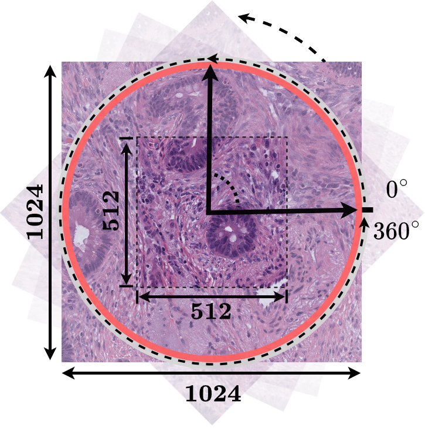
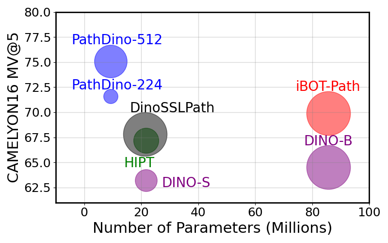
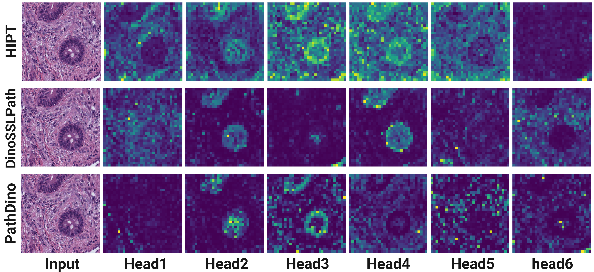
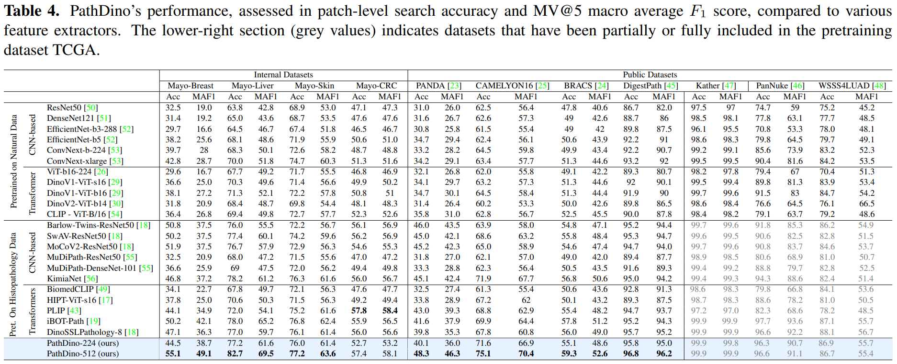
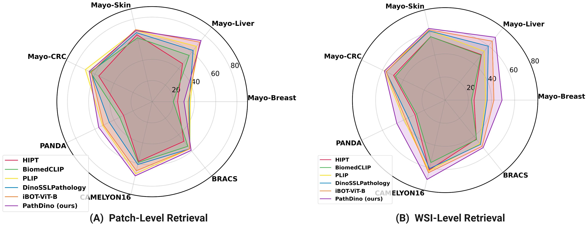

<!-- omit in toc -->
# PathDino: Rotation-Agnostic Image Representation Learning for Digital Pathology
<!-- omit in toc -->
### [Paper](https://openaccess.thecvf.com/content/CVPR2024/papers/Alfasly_Rotation-Agnostic_Image_Representation_Learning_for_Digital_Pathology_CVPR_2024_paper.pdf) | [Supplement](https://openaccess.thecvf.com/content/CVPR2024/supplemental/Alfasly_Rotation-Agnostic_Image_Representation_CVPR_2024_supplemental.pdf) | [Website](https://kimialabmayo.github.io/PathDino-Page/) | [Demo](https://huggingface.co/spaces/Saghir/PathDino) | [Dataset](https://github.com/KimiaLabMayo/PathDino/blob/main/preprocessing/gdc_manifest_svs_Diagnostic_slide_Open_11765.txt)


This repository contains the main training code and the pretrained weights of the CVPR 2024 paper: [Rotation-Agnostic Image Representation Learning for Digital Pathology](https://openaccess.thecvf.com/content/CVPR2024/html/Alfasly_Rotation-Agnostic_Image_Representation_Learning_for_Digital_Pathology_CVPR_2024_paper.html)

<!-- omit in toc -->
## Contents

- [Overview](#overview)
- [HistoRotate: Rotation-Agnostic Training](#historotate-rotation-agnostic-training)
- [PathDino: Histopathology Vision Transformer](#pathdino-histopathology-vision-transformer)
- [Dataset Preparation](#dataset-preparation)
- [PathDino Training](#pathdino-training)
- [PathDino Inference on Histopathology Image](#pathdino-inference-on-histopathology-image)
- [Results](#results)
- [Citation](#citation)


## Overview 

The proposed Whole Slide Image (WSI) analysis pipeline incorporates a fast patch selection method, \(**FPS**\), which efficiently selects representative patches while preserving spatial distribution. The second component, **HistoRotate**, introduces a \(360&deg;\) rotation augmentation for training histopathology models. Unlike natural images, histopathology patch rotation enhances learning without altering contextual information. The third module, **PathDino**, is a compact histopathology Transformer with only five small vision transformer blocks and ≈9 million parameters, markedly fewer than alternatives. Customized for histology images, PathDino demonstrates superior performance and mitigates overfitting, a common challenge in histology image analysis. 


## HistoRotate: Rotation-Agnostic Training
**HistoRotate** is a $360&deg;$ rotation augmentation for training models on histopathology images. Unlike training on natural images where the rotation may change the context of the visual data, rotating a histopathology patch does not change the context and it improves the learning process for better reliable embedding learning.

<p align="center">
  
</p>


## PathDino: Histopathology Vision Transformer
**PathDino** is a lightweight histopathology transformer consisting of just five small vision transformer blocks. PathDino is a customized ViT architecture, fine-tuned to the nuances of histology images. It not only exhibits superior performance but also effectively reduces susceptibility to overfitting, a common challenge in histology image analysis.


 MV@5 vs # Params vs FLOPs             |  PathDino vs HIPT vs DinoSSLPath
:-------------------------:|:-------------------------:
 |  

## Dataset Preparation
The proposed PathDino Pretraining Dataset. We extracted a total of $6,087,558$ patches from $11,765$ diagnostic TCGA WSIs. Specifically, $3,969,490$ patches have a 1024×1024 dimension, while $2,118,068$ patches have a $512\times 512$ dimension. The extraction was conducted at a 20× magnification level, with a tissue threshold of $90\%$. The pretrianing WSI list used from TCGA can be found [TCGA Diagnositc WSI List](https://portal.gdc.cancer.gov/repository?facetTab=files&filters=%7B%22op%22%3A%22and%22%2C%22content%22%3A%5B%7B%22op%22%3A%22in%22%2C%22content%22%3A%7B%22field%22%3A%22cases.project.program.name%22%2C%22value%22%3A%5B%22TCGA%22%5D%7D%7D%2C%7B%22op%22%3A%22in%22%2C%22content%22%3A%7B%22field%22%3A%22files.access%22%2C%22value%22%3A%5B%22open%22%5D%7D%7D%2C%7B%22op%22%3A%22in%22%2C%22content%22%3A%7B%22field%22%3A%22files.data_format%22%2C%22value%22%3A%5B%22svs%22%5D%7D%7D%2C%7B%22op%22%3A%22in%22%2C%22content%22%3A%7B%22field%22%3A%22files.experimental_strategy%22%2C%22value%22%3A%5B%22Diagnostic%20Slide%22%5D%7D%7D%5D%7D).

Overall, the patches tiled from TCGA stored in a data directory structure as follows:

```
TCGA
│   images_1024
│       └─000001.jpg
│       └─000002.jpg
│       └─000003.jpg
|   images_512
│       └─000001.jpg
│       └─000002.jpg
│       └─000003.jpg


```
**Note:** It is not necessary to get all the patches in two different dimensions $1024\times 1024$ and $512\times 512$. We recommend to patch all WSIs in $1024\times 1024$ size. This will help applying the $360^\circ$ rotation augmentation to each patch.

## PathDino Training
Train PathDino on single GPU run the following command:

```
python PathDino_main_512.py \
                            --arch pathdino \
                            --lr 0.0005 \
                            --epochs 27 \
                            --batch_size_per_gpu 64 \
                            --data_path /path/to/data/root/dir/ \
                            --output_dir /path/for/the/output/ \
                            --num_workers 24 \
```
To train the same model in a distributed multi-GPU mode, e.g., ```8 GPUs```: 
```
python -m torch.distributed.launch --nproc_per_node=8  PathDino_main_512.py \
                            --lr 0.0005 \
                            --epochs 27 \
                            --batch_size_per_gpu 64 \
                            --data_path /path/to/data/root/dir/ \
                            --output_dir /path/for/the/output/ \
                            --num_workers 24 \
                            --host '28500' \
```

## PathDino Inference on Histopathology Image
**To extract embeddings from histopathology images using the pretrained PathDino model:**

First, download the pretrained model ```PathDino512.pth``` from the [HuggingFace repo](https://huggingface.co/spaces/Saghir/PathDino/tree/main). Then, locate it in the ```./inference``` directory.

```python
from PathDino import get_pathDino_model
from PIL import Image
import torch

histoImg = Image.open('./inference/img.png')
model, transformInput = get_pathDino_model(weights_path='./inference/PathDino512.pth')

img = transformInput(histoImg)
embedding = model(img.unsqueeze(0))

print(embedding.shape)


```

**To visualize the activation maps as an animated GIFs:**

```
python example_visualizeAttention_gif.py inference/img.png --output_dir output

```
The output activation maps will be saved in the output directory as PNG images and animated GIFs for each attention head.
## Results

The results presented in Table $4$ provide an extensive comparative analysis of models in patch-level histopathology image search. The standout performer is our proposed model, PathDino-512. The model not only outperforms others in terms of accuracy but also establishes new benchmarks in the Macro Average F1 score, a critical metric for robust evaluation. For internal datasets such as Mayo-Breast and Mayo-Liver, PathDino-512 achieves the highest Accuracy rates of $55.1\%$ and $82.7\%$, respectively. More remarkably, it tops the Macro Average F1 score with 49.1% and $69.5\%$ in the same datasets. These findings extend to public datasets like PANDA and CAMELYON16, where PathDino-512 records accuracy and macro average F1 scores of $48.3\%$ and $46.3\%$, and $75.1\%$ and $70.4\%$, respectively. While it’s important to note the strong performance of models like iBOT-Path (student) and DinoSSLPathology, especially in public datasets, PathDino-512 consistently outperforms them across multiple metrics and datasets.

<p align="center">
 
</p>

<br/><br/>

<p align="center">
 
</p>

## Citation 
```
@InProceedings{Alfasly_2024_CVPR,
    author    = {Alfasly, Saghir and Shafique, Abubakr and Nejat, Peyman and Khan, Jibran and Alsaafin, Areej and Alabtah, Ghazal and Tizhoosh, H.R.},
    title     = {Rotation-Agnostic Image Representation Learning for Digital Pathology},
    booktitle = {Proceedings of the IEEE/CVF Conference on Computer Vision and Pattern Recognition (CVPR)},
    month     = {June},
    year      = {2024},
    pages     = {11683-11693}
}
```
**Acknowledgements** 

The code is built upon [Dino](https://github.com/facebookresearch/dino)

## Disclaimer
This code is intended for research purposes only. Any commercial use is prohibited.
